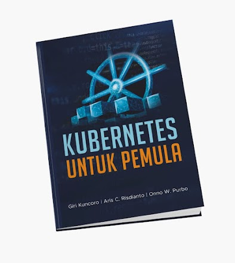

# Buku Kubernetes Untuk Pemula
Buku ini ditulis oleh [Aris Cahyadi Risdianto](https://github.com/ariscahyadi), [Giri Kuncoro](https://github.com/girikuncoro) dan [Onno W. Purbo](https://twitter.com/onnowpurbo) sebagai media pembelajaran dasar tentang teknologi Kubernetes. Sebagian besar buku ini diadopsi dari Buku “Kubernetes Up and Running” dan dokumentasi proyek Kubernetes berbahasa Indonesia. Kemudian agar lebih mudah dipahami buku disertai dengan aplikasi [kudemo](https://github.com/ngoprek-kubernetes/buku-kudemo) dan beberapa contoh [file-file konfigurasi](https://github.com/ngoprek-kubernetes/examples) untuk mengubahnya menjadi sebuah layanan berbasis web dan API (application programming interface) yang handal.

Saat ini buku ini bisa di pre-order melalui tautan berikut ini [https://bit.ly/PO-Kubernetes](https://bit.ly/PO-Kubernetes)

## Tentang Buku Ini

Karena perkembangan yang sangat cepat dari teknologi Kubernetes maka dibutuhkan sebuah buku yang mampu merangkum bagaimana cara menggunakan konsep inti dari Kubernetes dan apa saja motivasi di balik pengembangan Kubernetes itu sendiri. Melalui buku ini, kita tidak hanya akan mempelajari cara membangun aplikasi yang andal, efisien, dan dapat diskalakan di atas Kubernetes, tetapi juga menambah wawasan tentang tantangan mengapa inti sistem terdistribusi tersebut dikembangkan.
Buku ini akan menjelaskan tentang orkestrasi sebuah klaster Kubernetes dan bagaimana tools dan API-nya yang dapat digunakan untuk meningkatkan pengembangan, pengiriman, dan pemeliharaan aplikasi terdistribusi. Meskipun sebagian kita belum memiliki pengalaman sebelumnya dengan kontainer dan Kubernetes, buku ini seharusnya dapat dimanfaatkan secara maksimal sehingga kita nyaman dan percaya diri untuk membangun dan menerapkan aplikasi berskala besar tanpa memikirkan mesin server. Pengetahuan dasar tentang konsep dan pengalaman tentang sistem penyeimbang beban, sistem operasi Linux, Linux Container, dan Docker akan sangat membantu untuk memanfaatkan konsep-konsep dalam buku ini sebaik-baiknya.

## Daftar Isi

Sebagian daftar isi dari buku ini dapat dilihat [disini]()

## Ucapan Terima Kasih

Penulis mengucapkan syukur dan terima kasih kepada Tuhan yang maha esa dan semua pihak yang telah membantu penyelesaian buku ini, terutama kepada 100 lebih kontributor terjemahan [dokumentasi Kubernetes](https://github.com/kubernetes/website) dalam bahasa Indonesia yang banyak dirujuk di buku ini.

